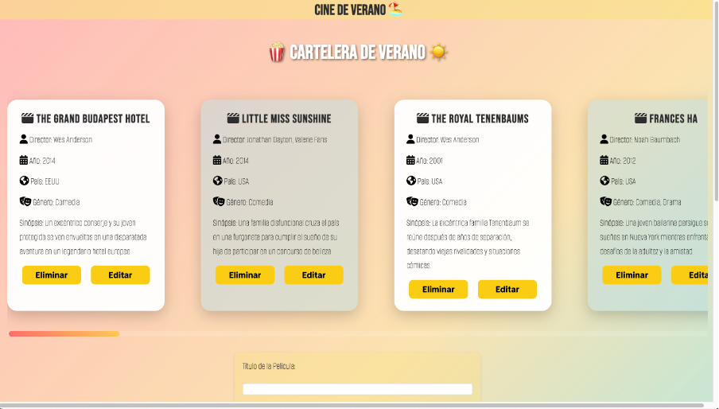

# 🎬 Cine de Verano ☀️

Este es un proyecto desarrollado durante el Bootcamp Full Stack Web Development en Factoría F5, orientado a construir una cartelera interactiva de películas para un evento de **Cine de Verano**.

Permite al usuario:
- Ver películas en formato carrusel
- Agregar nuevas películas mediante formulario
- Editar y eliminar películas
- Visualizar información relevante de cada título con íconos temáticos

---

## 📸 Captura del proyecto

---

## 🚀 Tecnologías utilizadas

- **HTML5**
- **CSS3**
- **JavaScript** (Vanilla)
- **Fetch API**
- **JSON Server** (para simular la base de datos)
- [**Google Fonts**](https://fonts.google.com/) para tipografías personalizadas
- [**Font Awesome**](https://fontawesome.com/) para íconos visuales
- Carrusel horizontal con `scroll-snap` en CSS (https://developer.mozilla.org/en-US/docs/Web/CSS/CSS_overflow/CSS_carousels)

---